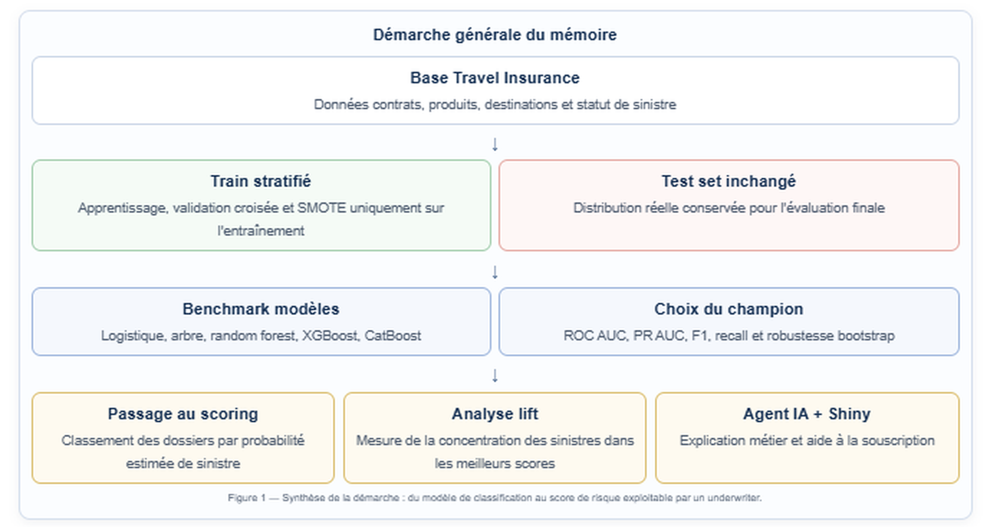

```{r setup, include=FALSE}
knitr::opts_chunk$set(echo = FALSE, message = FALSE, warning = FALSE)

qmd_input <- knitr::current_input()
if (!dir.exists("reports") && !is.null(qmd_input)) {
  setwd(normalizePath(file.path(dirname(qmd_input), "..", "..")))
}

library(dplyr)
library(readr)
library(knitr)
library(here)
library(ggplot2)

read_csv_if_exists <- function(path) {
  if (file.exists(path)) read_csv(path, show_col_types = FALSE) else NULL
}

include_img <- function(path, caption) {
  if (file.exists(path)) {
    knitr::include_graphics(path)
  } else {
    cat(paste0("*Graphique non disponible : ", caption, "*"))
  }
}

fmt_pct <- function(x, digits = 1) paste0(round(100 * x, digits), " %")

plot_process_diagram <- function() {
  steps <- tibble::tibble(
    x = 1:5,
    title = c("Données", "Modélisation", "Score", "Lift", "Agent IA"),
    detail = c(
      "Base nettoyée
Train/test stratifié",
      "Validation croisée
SMOTE sur train seulement",
      "Probabilité estimée
de sinistre",
      "Priorisation
par segments de risque",
      "Explication métier
et recommandation"
    ),
    fill = c("#eef4fb", "#eaf6ef", "#fff7e8", "#fbeeed", "#eef4fb")
  )
  ggplot(steps, aes(x = x, y = 1)) +
    geom_segment(
      data = tibble::tibble(x = 1:4),
      aes(x = x + 0.28, xend = x + 0.72, y = 1, yend = 1),
      inherit.aes = FALSE,
      arrow = grid::arrow(length = grid::unit(0.16, "inches")),
      color = "#2f5b89",
      linewidth = 0.7
    ) +
    geom_label(
      aes(label = paste0(title, "
", detail), fill = fill),
      label.size = 0.35,
      color = "#173B5F",
      size = 3.2,
      lineheight = 0.88,
      label.padding = grid::unit(0.25, "lines")
    ) +
    scale_fill_identity() +
    coord_cartesian(xlim = c(0.55, 5.45), ylim = c(0.55, 1.45), clip = "off") +
    theme_void()
}

dimensions <- read_csv_if_exists(here("reports", "eda_dimensions.csv"))
structure_summary <- read_csv_if_exists(here("reports", "eda_structure.csv"))
numeric_summary <- read_csv_if_exists(here("reports", "eda_numeric_summary.csv"))
categorical_by_target <- read_csv_if_exists(here("reports", "eda_categorical_by_target.csv"))
correlation_matrix <- read_csv_if_exists(here("reports", "correlation_matrix.csv"))
target_distribution <- read_csv_if_exists(here("reports", "target_distribution.csv"))
model_comparison <- read_csv_if_exists(here("reports", "model_comparison.csv"))
model_thresholds <- read_csv_if_exists(here("reports", "model_thresholds.csv"))
model_ranking <- read_csv_if_exists(here("reports", "model_ranking.csv"))
final_metrics <- read_csv_if_exists(here("reports", "final_metrics.csv"))
bootstrap_summary <- read_csv_if_exists(here("reports", "bootstrap_summary.csv"))
threshold_analysis <- read_csv_if_exists(here("reports", "threshold_analysis.csv"))
selected_thresholds <- read_csv_if_exists(here("reports", "selected_thresholds.csv"))
class_balance_summary <- read_csv_if_exists(here("reports", "class_balance_summary.csv"))
training_data_audit <- read_csv_if_exists(here("reports", "training_data_audit.csv"))
classification_metrics_by_model <- read_csv_if_exists(here("reports", "classification_metrics_by_model.csv"))
smote_effect_on_metrics <- read_csv_if_exists(here("reports", "smote_effect_on_metrics.csv"))
risk_ranking_lift_table <- read_csv_if_exists(here("reports", "risk_ranking_lift_table.csv"))
model_comparison_smote_intensity <- read_csv_if_exists(here("reports", "model_comparison_smote_intensity.csv"))
smote_intensity_class_balance <- read_csv_if_exists(here("reports", "smote_intensity_class_balance.csv"))
xgboost_lift_by_smote_intensity <- read_csv_if_exists(here("reports", "xgboost_lift_by_smote_intensity.csv"))
hyperparameter_tuning_results <- read_csv_if_exists(here("reports", "hyperparameter_tuning_results.csv"))
hyperparameter_tuning_cv_results <- read_csv_if_exists(here("reports", "hyperparameter_tuning_cv_results.csv"))
best_tuned_models <- read_csv_if_exists(here("reports", "best_tuned_models.csv"))
tuned_model_test_metrics <- read_csv_if_exists(here("reports", "tuned_model_test_metrics.csv"))
tuned_model_lift_analysis <- read_csv_if_exists(here("reports", "tuned_model_lift_analysis.csv"))
champion_vs_tuned_comparison <- read_csv_if_exists(here("reports", "champion_vs_tuned_comparison.csv"))
catboost_hyperparameter_results <- read_csv_if_exists(here("reports", "catboost_hyperparameter_results.csv"))
catboost_test_metrics <- read_csv_if_exists(here("reports", "catboost_test_metrics.csv"))
catboost_lift_analysis <- read_csv_if_exists(here("reports", "catboost_lift_analysis.csv"))
xgboost_vs_catboost_comparison <- read_csv_if_exists(here("reports", "xgboost_vs_catboost_comparison.csv"))
hyperparameters_grid_summary <- read_csv_if_exists(here("reports", "hyperparameters_grid_summary.csv"))
best_hyperparameters_by_model <- read_csv_if_exists(here("reports", "best_hyperparameters_by_model.csv"))
final_model_selection_summary <- read_csv_if_exists(here("reports", "final_model_selection_summary.csv"))
shap_global_importance <- read_csv_if_exists(here("reports", "shap_global_importance.csv"))
shap_grouped_importance <- read_csv_if_exists(here("reports", "shap_grouped_importance.csv"))
no_tariff_model_comparison <- read_csv_if_exists(here("reports", "no_tariff_model_comparison.csv"))
no_tariff_model_ranking <- read_csv_if_exists(here("reports", "no_tariff_model_ranking.csv"))
no_tariff_test_metrics <- read_csv_if_exists(here("reports", "no_tariff_test_metrics.csv"))
no_tariff_lift_table <- read_csv_if_exists(here("reports", "no_tariff_risk_ranking_lift_table.csv"))
tariff_vs_no_tariff_champions <- read_csv_if_exists(here("reports", "tariff_vs_no_tariff_champions.csv"))
confusion_matrix <- read_csv_if_exists(here("reports", "confusion_matrix.csv"))
metadata <- if (file.exists(here("models", "model_metadata.rds"))) readRDS(here("models", "model_metadata.rds")) else NULL
```

**Mots-clés :** assurance voyage ; sinistre rare ; scoring du risque ; aide à la souscription ; Machine Learning ; XGBoost ; SMOTE ; bootstrap ; validation croisée ; déséquilibre de classes ; ROC AUC ; PR AUC ; lift ; SHAP ; agent IA ; application Shiny ; underwriting.

```{r}
#| label: fig-resume-executif-visuel
#| fig-cap: "Résumé exécutif, problématique et contributions du mémoire."
#| out-width: "100%"

```

```{r}
#| label: fig-demarche-generale-visuel
#| fig-cap: "Démarche générale du mémoire : de la base initiale au scoring et à l’agent IA."
#| out-width: "100%"

```

# Fondements théoriques et contexte actuariel

Ce mémoire étudie l'application du Machine Learning à l'assurance voyage, avec un objectif opérationnel : estimer la probabilité de survenance d'un sinistre. Le projet s'inscrit dans une démarche actuarielle appliquée, où le modèle n'est pas uniquement un outil prédictif, mais aussi un support d'analyse du risque et d'aide à la décision.

La cible du projet est `claim_status`, construite à partir de la variable de statut de sinistre disponible dans la base. La classe positive est `yes`, qui correspond à la présence d'un sinistre, et la classe négative est `no`.

## Problématique métier et objectif actuariel

En assurance voyage, les sinistres sont généralement rares mais financièrement et opérationnellement importants. Pouvoir attribuer une probabilité de sinistre à un contrat permet d'alimenter des analyses de segmentation, de surveillance du portefeuille, de tarification exploratoire et de priorisation des contrôles.

Le modèle ne remplace pas le jugement actuariel. Il fournit un score de risque qui doit être interprété avec les limites de la base, la politique de souscription, les garanties couvertes et les contraintes réglementaires.

## Modéliser un sinistre rare : enjeux statistiques

La prédiction de sinistres relève d'un problème de classification binaire très déséquilibré. La majorité des observations correspond à une absence de sinistre, tandis que la classe `yes` représente une fraction très faible du portefeuille. Cette structure pose trois difficultés principales.

Premièrement, le modèle peut apprendre à privilégier la classe majoritaire. Dans ce cas, il obtient une accuracy élevée en prédisant presque toujours `no`, mais il détecte mal les dossiers sinistrés. Deuxièmement, les métriques usuelles deviennent moins lisibles : une bonne accuracy ne signifie pas nécessairement une bonne capacité de détection du risque. Troisièmement, la rareté des sinistres rend l'estimation plus instable, car quelques observations positives peuvent influencer fortement les mesures de recall, de précision ou de F1-score.

Pour cette raison, la démarche retenue combine plusieurs outils : validation croisée stratifiée, métriques adaptées aux classes rares, analyse de seuils, analyse de lift, bootstrap et comparaison entre stratégies de rééquilibrage. Le modèle est évalué comme un outil de scoring et non uniquement comme un classifieur binaire au seuil de 50 %.

## Modèles supervisés et logique probabiliste

Le cadre général est celui de l'apprentissage supervisé. On observe, pour chaque dossier $i$, un vecteur de caractéristiques $X_i$ et une variable cible $Y_i$ indiquant la présence ou l'absence de sinistre. Le modèle cherche à approximer la probabilité conditionnelle :

$$P(Y = yes \mid X = x).$$

Cette probabilité estimée peut ensuite être utilisée de deux façons. La première consiste à fixer un seuil de décision et à transformer le score en classe prédite. La seconde, plus adaptée à ce projet, consiste à utiliser directement le score pour hiérarchiser les dossiers. En assurance, cette deuxième lecture est souvent plus pertinente : l'enjeu n'est pas seulement de prédire `yes` ou `no`, mais d'identifier les dossiers qui méritent une analyse prioritaire.

La modélisation ne se réduit donc pas à la maximisation d'une métrique unique. Elle doit arbitrer entre détection des sinistres, maîtrise des faux positifs, robustesse statistique et lisibilité métier. C'est cette logique qui justifie la comparaison entre modèles classiques, modèles d'ensemble, rééquilibrage par SMOTE, tuning raisonnable et analyse de lift.

## XGBoost et modèles de gradient boosting

XGBoost appartient à la famille des méthodes de **gradient boosting**. Le principe général consiste à construire un modèle prédictif fort en agrégeant progressivement plusieurs modèles faibles, généralement des arbres de décision. Chaque nouvel arbre est entraîné pour corriger les erreurs résiduelles des arbres précédents. Le modèle final est donc une somme d'arbres, construite de manière séquentielle.

D'un point de vue intuitif, un arbre de décision découpe l'espace des variables en zones homogènes. Le boosting répète cette opération plusieurs fois : les premiers arbres capturent les effets les plus structurants, puis les arbres suivants se concentrent sur les erreurs restantes. XGBoost optimise une fonction de perte et ajoute des termes de régularisation afin de contrôler la complexité du modèle. Cette régularisation est essentielle en assurance, car le modèle peut facilement surapprendre des segments rares ou des combinaisons spécifiques présentes dans l'échantillon.

Les principaux hyperparamètres mobilisés dans ce mémoire ont chacun un rôle précis. Le nombre d'arbres (`trees`) contrôle la taille de l'ensemble. La profondeur des arbres (`tree_depth`) détermine le niveau d'interaction que le modèle peut apprendre. Le taux d'apprentissage (`learn_rate`) ralentit ou accélère la contribution de chaque arbre. Les paramètres de taille minimale de noeud, de sous-échantillonnage des lignes et de sous-échantillonnage des variables limitent le surapprentissage. Enfin, la pondération de classe peut être utilisée pour donner davantage d'importance aux sinistres dans la fonction objectif.

L'intérêt de XGBoost tient à sa capacité à capturer naturellement des relations non linéaires et des interactions entre variables. En assurance voyage, l'effet d'une destination, d'une durée de voyage, d'un produit ou d'un canal de distribution peut dépendre d'autres caractéristiques du dossier. Une relation strictement linéaire serait souvent trop restrictive. Dans ce projet, XGBoost est donc utilisé non seulement comme classifieur, mais surtout comme **fonction de scoring** : il attribue à chaque dossier une probabilité estimée de sinistre, ensuite utilisée pour hiérarchiser le portefeuille.

## SMOTE et apprentissage sur classes déséquilibrées

Le problème étudié est fortement déséquilibré : les sinistres représentent une part très faible des observations. Dans ce contexte, un modèle peut obtenir une accuracy élevée tout en détectant très peu de sinistres. La classe minoritaire `yes` doit donc faire l'objet d'une attention particulière.

SMOTE, pour *Synthetic Minority Over-sampling Technique*, est une méthode de rééquilibrage qui crée des observations synthétiques de la classe minoritaire. Contrairement à une simple duplication, SMOTE génère de nouveaux points par interpolation entre observations minoritaires proches. L'idée est de densifier localement l'espace des sinistres afin d'aider le modèle à mieux identifier les zones associées à un risque plus élevé.

Dans le pipeline, SMOTE est appliqué uniquement sur les données d'entraînement, ou à l'intérieur des folds de validation croisée. Il n'est jamais appliqué au test set, afin de conserver une évaluation réaliste sur la distribution originale du portefeuille. Cette distinction est essentielle pour éviter une fuite de données : le test set doit représenter ce que le modèle rencontrerait en situation réelle, avec la rareté naturelle des sinistres.

SMOTE n'est toutefois pas une solution automatiquement meilleure. Un rééquilibrage trop fort peut déformer la distribution d'apprentissage et conduire le modèle à produire trop d'alertes. Il peut aussi être moins pertinent lorsque certaines variables sont catégorielles encodées, car l'interpolation dans un espace transformé ne correspond pas toujours à une observation métier naturelle. Dans ce mémoire, SMOTE améliore le benchmark complet lorsque les variables tarifaires sont conservées, mais il n'améliore pas l'approche sans variables tarifaires. Cette différence est méthodologiquement importante : elle montre que le rééquilibrage doit être testé empiriquement, et non appliqué de manière systématique.

## Validation croisée, échantillon test et bootstrap

La validation croisée permet d'estimer la performance d'un modèle de façon plus stable qu'une seule séparation apprentissage/test. Dans ce projet, une validation croisée stratifiée en cinq folds est utilisée : le train est découpé en plusieurs sous-échantillons, en conservant autant que possible la proportion de sinistres dans chaque fold. À chaque itération, le modèle est entraîné sur quatre folds et évalué sur le fold restant. Les métriques sont ensuite moyennées.

Cette approche n'est pas en conflit avec l'utilisation d'un test set final. Les deux niveaux répondent à deux objectifs différents. La validation croisée sert à comparer les modèles, calibrer certains seuils et choisir une configuration. Le test set, lui, reste isolé jusqu'à l'évaluation finale et sert à estimer la performance du modèle retenu sur des observations non utilisées pour l'apprentissage ni pour le choix du modèle.

Cette séparation est particulièrement importante dans un mémoire actuariel, car elle limite le risque d'optimisme dans l'évaluation. Si l'on choisissait le modèle directement sur le test set, celui-ci deviendrait implicitement un outil de sélection et ne fournirait plus une mesure indépendante de généralisation. La validation croisée joue donc le rôle de laboratoire de comparaison, tandis que le test set joue le rôle d'épreuve finale.

Le bootstrap complète cette logique. Il consiste à tirer plusieurs échantillons avec remise à partir du train, à réentraîner le modèle champion, puis à mesurer la variabilité des performances sur le test set inchangé. L'objectif du bootstrap n'est pas de corriger le déséquilibre de classes. Il sert plutôt à observer comment les métriques varient lorsque l'échantillon d'entraînement change légèrement. Si les performances sont très instables d'une réplication à l'autre, le modèle doit être interprété avec prudence. Si elles restent relativement concentrées, cela renforce la confiance dans la robustesse du score.

## Métriques adaptées aux sinistres rares et au scoring

Dans un problème de sinistres rares, l'accuracy seule est insuffisante. Un modèle qui prédit systématiquement l'absence de sinistre peut obtenir une très bonne accuracy, mais il est inutilisable pour détecter les dossiers risqués. Le mémoire mobilise donc plusieurs métriques complémentaires : recall, précision, F1-score, ROC AUC, PR AUC, analyse de seuils et lift.

Le recall mesure la part des sinistres effectivement détectés parmi tous les sinistres observés. Il est important lorsqu'un faux négatif représente un dossier risqué non identifié. La précision mesure la part de vrais sinistres parmi les dossiers signalés comme risqués ; elle est importante pour éviter de saturer l'underwriter avec trop de faux positifs. Le F1-score synthétise précision et recall, mais il reste dépendant du seuil de classification retenu.

La ROC AUC mesure la capacité générale du modèle à ordonner les sinistres avant les non-sinistres, indépendamment d'un seuil unique. La PR AUC est souvent plus informative lorsque la classe positive est rare, car elle se concentre sur la performance autour de la classe minoritaire. Le lift a une interprétation directement métier : il indique combien un segment de dossiers scorés comme risqués est plus sinistré que la moyenne du portefeuille.

L'approche finale du projet est donc orientée **scoring/ranking** plutôt que décision automatique. Un bon modèle actuariel dans ce contexte n'est pas nécessairement celui qui maximise l'accuracy, mais celui qui concentre utilement le risque dans les premiers segments de score. Cette logique est cohérente avec un usage d'aide à la décision : prioriser les dossiers, expliciter le niveau de risque et laisser la décision finale à l'underwriter.

# Modélisation du risque de sinistre

Cette section présente la construction du modèle de risque de sinistre à partir de la base Travel Insurance. L'objectif n'est pas seulement de produire une classe prédite, mais de construire un score utilisable pour hiérarchiser les dossiers, éclairer une revue humaine et documenter les arbitrages entre sinistres détectés et faux positifs. Les résultats numériques sont repris des fichiers produits dans `reports/` et des artefacts sauvegardés dans `models/` ; aucun entraînement n'est relancé dans le rapport.

## Données et préparation du portefeuille

La base initiale contient des informations relatives au canal de distribution, au produit souscrit, à la destination, à la durée du voyage, à l’âge de l’assuré, ainsi qu’aux variables tarifaires et commerciales du contrat. Elle est transformée en une table exploitable pour une modélisation supervisée : une ligne par dossier, une cible binaire explicite, des noms de variables stables et des contrôles de cohérence compatibles avec le prétraitement des données.
`tidymodels`.

```{r data-overview}
if (!is.null(dimensions)) {
  kable(dimensions, caption = "Dimensions de la base nettoyée")
}
```

La base brute contient **63 326 lignes** et 11 variables. Le nettoyage supprime **8 042 doublons exacts**, ce qui ramène le portefeuille exploitable à **55 284 observations** et **11 variables**. Cette suppression est importante : conserver des doublons stricts reviendrait à donner un poids artificiel à certains profils et pourrait biaiser l'apprentissage comme la validation.

```{r cleaning-audit}
raw_path <- here("data", "raw", "travel_insurance.csv")
clean_path <- here("data", "processed", "data_clean.rds")
if (file.exists(raw_path) && file.exists(clean_path)) {
  raw_data <- readr::read_csv(raw_path, show_col_types = FALSE)
  clean_data <- readRDS(clean_path)
  cleaning_audit <- tibble::tibble(
    Indicateur = c("Base brute", "Doublons supprimés", "Base nettoyée", "Doublons restants"),
    Valeur = c(nrow(raw_data), sum(duplicated(raw_data)), nrow(clean_data), sum(duplicated(clean_data)))
  )
  kable(cleaning_audit, caption = "Audit synthétique du nettoyage")
}
```

Les noms de colonnes sont standardisés avec la fonction `janitor::clean_names()`. La variable locale `Claim` est renommée `claim_status`, afin d’identifier clairement la cible dans l’ensemble de la chaîne de traitement. Les variables numériques principales (`duration`, `net_sales`, `commision_in_value`, `age`) ne présentent pas de valeurs manquantes dans la base nettoyée. La variable `gender` contient en revanche un volume important de valeurs manquantes. Elle n’est pas supprimée, car cela conduirait à retirer une part trop importante du portefeuille et pourrait modifier la représentativité des observations. Elle est donc conservée, puis traitée lors du prétraitement des données comme une information incomplète.

Les valeurs atypiques sont conservées mais documentées. Des durées négatives ou très longues, des ventes nettes négatives ou des âges extrêmes peuvent correspondre à des erreurs de saisie, mais aussi à des annulations, à des ajustements commerciaux ou à des contrats particuliers. En l’absence de règle métier externe permettant de les qualifier avec certitude comme erreurs, une suppression automatique aurait introduit un choix arbitraire. Le choix retenu est donc prudent : conserver ces observations, les documenter, puis s’appuyer sur un prétraitement robuste avant la modélisation.

```{r target-table}
if (!is.null(target_distribution)) {
  target_display <- target_distribution %>%
    transmute(Classe = claim_status, Observations = n, Part = share)
  kable(target_display, digits = 4, caption = "Distribution de la cible claim_status")
}
```

Le taux de sinistre est de **1,67 %** : 921 sinistres contre 54 363 non-sinistres. Cette rareté explique pourquoi l'analyse exploratoire doit rester prudente. Certaines agences, certains produits et certaines destinations présentent des taux de sinistre plus élevés que la moyenne, mais ces écarts doivent être interprétés avec les volumes associés. L’analyse exploratoire sert donc à vérifier les ordres de grandeur, à repérer les variables plausiblement informatives et à préparer la modélisation, sans conclure à elle seule sur la causalité ou la rentabilité d'un segment.

```{r fig-target-main, fig.cap="Distribution de la cible claim_status", out.width="72%", fig.align="center"}
include_img(here("reports", "figures", "target_distribution.png"), "Distribution de la cible")
```

La figure confirme visuellement que la classe sinistre est marginale. Pour l'assureur, cette situation implique que le modèle doit surtout être jugé sur sa capacité à isoler les dossiers les plus risqués, et non sur sa capacité à reconnaître la classe majoritaire. Elle justifie également la suite de l'analyse : métriques adaptées, validation stratifiée et étude des seuils.

Les distributions numériques sont également asymétriques. La durée, les ventes nettes et la commission ont des queues longues ; la commission est souvent nulle, mais quelques contrats concentrent des montants élevés. Cette structure est typique d'un portefeuille commercial hétérogène et justifie l'utilisation de modèles capables de capter des effets non linéaires.

```{r fig-numeric-main, fig.cap="Variables numériques selon la cible", out.width="86%", fig.align="center"}
include_img(here("reports", "figures", "numeric_by_target.png"), "Variables numériques selon la cible")
```

La comparaison par cible ne montre pas une séparation simple et parfaite entre sinistres et non-sinistres. Les sinistres se situent plutôt dans certains segments de durée, d'âge ou de montant, avec beaucoup de recouvrement entre les classes. Cette lecture plaide pour une approche de scoring probabiliste : le modèle doit combiner plusieurs signaux faibles plutôt que chercher une règle univariée.

```{r fig-categorical-main, fig.cap="Variables catégorielles selon la cible", out.width="86%", fig.align="center"}
include_img(here("reports", "figures", "categorical_by_target.png"), "Variables catégorielles selon la cible")
```

Les variables catégorielles apportent une information métier importante : produit, agence, destination et canal de distribution structurent l'exposition du portefeuille. Les différences observées doivent toutefois être lues conjointement avec les volumes. Un taux élevé sur une modalité rare n'a pas la même portée actuarielle qu'un écart plus modéré sur un segment fortement représenté.

```{r class-balance-main}
if (!is.null(class_balance_summary)) {
  class_balance_display <- class_balance_summary %>%
    filter(dataset_stage %in% c("full_data_original", "train_before_smote", "test_unchanged")) %>%
    transmute(
      Étape = dataset_stage,
      Non_sinistres = n_no,
      Sinistres = n_yes,
      `Part sinistres` = prop_yes,
      Total = total_observations
    )
  kable(class_balance_display, digits = 4, caption = "Déséquilibre de classes avant rééquilibrage")
}
```

La séparation entre l’échantillon d’apprentissage et l’échantillon de test est stratifiée sur `claim_status`. L’échantillon d’apprentissage contient **44 227 observations**, tandis que l’échantillon de test en contient **11 057**. Ce dernier reste inchangé pendant toute la démarche : il n’est ni rééquilibré, ni utilisé pour apprendre les transformations, ni mobilisé pour choisir le modèle. Cette séparation permet de limiter le risque de fuite de données et de conserver une évaluation plus réaliste de la performance.

Le prétraitement des données est appris uniquement sur l’échantillon d’apprentissage, ou à l’intérieur des plis de validation croisée. Il comprend l’imputation des valeurs manquantes, le regroupement des modalités rares, la gestion des nouvelles modalités, l’encodage one-hot, la normalisation éventuelle des variables numériques et la suppression des variables à variance nulle. Cette organisation permet d’appliquer à l’échantillon de test uniquement des transformations apprises en amont, ce qui se rapproche davantage d’une situation de production.

L’enjeu méthodologique est central : si les modalités rares, les imputations ou les normalisations étaient estimées sur l’ensemble de la base avant la séparation apprentissage/test, l’échantillon de test influencerait indirectement l’apprentissage. Le rapport conserve donc une séparation stricte entre ce qui est appris sur l’échantillon d’apprentissage et ce qui est simplement projeté sur l’échantillon de test.

## Modèle complet enrichi par variables tarifaires

Le premier scénario conserve l’ensemble des informations disponibles, y compris les variables tarifaires et commerciales `net_sales` et `commision_in_value`. Il s’agit d’un **benchmark prédictif enrichi par variables tarifaires**, et non du modèle applicatif final. Ces variables peuvent améliorer la prédiction, car elles reflètent déjà une partie des caractéristiques économiques du contrat, du produit souscrit ou du canal de vente.

Cette information est utile pour mesurer la performance maximale atteignable avec la base disponible. Elle doit toutefois être interprétée avec prudence dans une perspective de souscription. Si le score est destiné à être calculé avant tarification définitive, utiliser une prime nette ou une commission déjà observée peut créer une forme de circularité : le modèle risque de réutiliser une information qui reflète déjà une décision commerciale ou tarifaire. C’est pourquoi le modèle sans variables tarifaires est discuté ensuite comme version plus adaptée à l’application Shiny.

Le modèle complet garde donc une place importante dans le mémoire : il sert de référence statistique, permet de mesurer l’apport prédictif des variables tarifaires et donne un point de comparaison pour évaluer le coût prédictif d’une approche plus prudente sans prime ni commission.

## Benchmark, SMOTE et choix du champion

Le benchmark compare plusieurs familles de modèles : régression logistique, arbre de décision, forêt aléatoire et XGBoost. Ces approches ne répondent pas exactement au même besoin. La régression logistique constitue une référence linéaire lisible ; l’arbre de décision est facilement interprétable mais peut être instable ; la forêt aléatoire améliore la robustesse par agrégation de plusieurs arbres ; XGBoost permet de capter plus finement les interactions et les non-linéarités, ce qui est pertinent pour un portefeuille combinant produit, destination, durée du voyage et variables tarifaires ou commerciales.

SMOTE est testé comme stratégie de rééquilibrage de la classe rare. Il crée des observations synthétiques de la classe `yes` uniquement dans l’échantillon d’apprentissage ou à l’intérieur des plis de validation croisée. L’échantillon de test reste inchangé. L’effet attendu est une amélioration du rappel, c’est-à-dire une meilleure détection des sinistres. La contrepartie possible est une augmentation du nombre de faux positifs, et donc une précision plus faible.

```{r fig-smote-main, fig.cap="Effet de SMOTE sur la balance des classes", out.width="78%", fig.align="center"}
include_img(here("reports", "figures", "class_balance_smote_effect.png"), "Effet de SMOTE sur la balance des classes")
```

Cette figure rappelle que SMOTE ne transforme pas le problème métier : les sinistres restent rares dans l'e test set'échantillon test. Il modifie seulement la distribution vue par le modèle pendant l'apprentissage. Le gain attendu porte donc sur la sensibilité du modèle à la classe minoritaire, pas sur la fréquence réelle des sinistres dans le portefeuille.

```{r model-thresholds-clean-section2}
if (!is.null(metadata) && !is.null(metadata$model_thresholds)) {
  model_thresholds_clean <- metadata$model_thresholds %>%
    transmute(
      Configuration = config_id,
      Modèle = model,
      Stratégie = strategy,
      Seuil = threshold,
      Précision = precision,
      Recall = recall,
      F1 = f_meas
    ) %>%
    arrange(desc(F1), desc(Recall))
  kable(model_thresholds_clean, digits = 4, caption = "Comparaison synthétique des configurations au seuil calibré")
}
```

Le champion complet retenu est **`xgboost__smote`**. Ce choix est cohérent avec l'objectif de détection d'événements rares : il accepte plus d'alertes pour récupérer davantage de sinistres. Dans un contexte d'aide à la souscription, ce compromis est défendable si les alertes servent à prioriser une revue humaine plutôt qu'à prendre une décision automatique.

```{r final-model-selection-summary}
if (!is.null(final_model_selection_summary)) {
  final_selection_display <- final_model_selection_summary %>%
    transmute(
      Candidat = candidate_model,
      Stratégie = strategy,
      `ROC AUC` = roc_auc,
      `PR AUC` = pr_auc,
      Recall = recall,
      Précision = precision,
      `Lift 10 %` = lift_top_10
    )
  kable(final_selection_display, digits = 4, caption = "Synthèse finale de sélection du modèle complet")
}
```

Les tableaux complets de tuning, les variantes détaillées de SMOTE et les classements intermédiaires sont conservés en annexe ou dans les fichiers `reports/*.csv`. Ils ne sont pas repris intégralement dans le corps du rapport afin de préserver le fil actuariel principal.

Le choix de `xgboost__smote` ne signifie donc pas que SMOTE est systématiquement supérieur, ni que XGBoost doit être retenu dans tous les contextes. Il signifie que, pour ce portefeuille et cette information disponible, cette combinaison donne le meilleur compromis observé entre discrimination globale, détection des sinistres et stabilité de la performance.

## Résultats du champion et lecture métier

```{r champion-text, results='asis'}
if (!is.null(metadata)) {
  champ <- metadata$champion
  threshold <- metadata$decision_threshold$threshold
  cat(sprintf(
    "Le modèle champion complet est **%s**. Le seuil de décision retenu pour les métriques finales est **%s**.",
    champ$config_id,
    threshold
  ))
}
```

```{r final-metrics}
if (!is.null(final_metrics)) {
  final_metrics_display <- final_metrics %>%
    transmute(Métrique = .metric, Valeur = .estimate)
  kable(final_metrics_display, digits = 4, caption = "Métriques finales du champion sur le test set")
}
```

```{r confusion-table}
if (!is.null(confusion_matrix)) {
  confusion_display <- confusion_matrix %>%
    transmute(Prédiction = Prediction, Réalité = Truth, Nombre = n)
  kable(confusion_display, caption = "Matrice de confusion sur le test set")
}
```

Au seuil **0,48**, la matrice de confusion donne **TN = 10 044**, **FP = 827**, **FN = 109** et **TP = 77**. Le modèle détecte donc une partie significative des sinistres, avec un **recall de 0,4140**, mais il génère aussi de nombreuses alertes, avec une **précision de 0,0852**.

La **ROC AUC de 0,8218** indique une bonne capacité de discrimination globale : le modèle ordonne correctement une partie importante des dossiers selon leur risque. La **PR AUC de 0,0845** reste modeste en valeur absolue, mais elle est à lire dans un contexte où la prévalence n'est que de 1,67 %. Le **F1 de 0,1413** traduit le compromis difficile entre détection et pureté des alertes.

```{r fig-roc-main, fig.cap="Courbe ROC du modèle champion", out.width="74%", fig.align="center"}
include_img(here("reports", "figures", "roc_curve.png"), "Courbe ROC du modèle champion")
```

```{r fig-pr-main, fig.cap="Courbe précision-rappel du modèle champion", out.width="74%", fig.align="center"}
include_img(here("reports", "figures", "precision_recall_curve.png"), "Courbe précision-rappel du modèle champion")
```

La courbe ROC montre que le modèle conserve une capacité de ranking exploitable sur l'ensemble du test set. La courbe précision-rappel est plus sévère, ce qui est normal dans un portefeuille où les sinistres sont rares : dès que le modèle cherche à détecter davantage de sinistres, il inclut nécessairement beaucoup de dossiers non sinistrés parmi les alertes.

La lecture métier est donc nuancée. Le champion complet est plutôt prudent : il cherche à détecter plus de sinistres, quitte à produire des faux positifs. Il est utile pour prioriser une revue humaine et organiser les contrôles, mais il ne doit pas être utilisé comme règle automatique d'acceptation, de refus ou de tarification.

## Seuils et robustesse

Le seuil de classification influence directement le nombre de sinistres détectés, le volume d'alertes et le nombre de faux positifs. En assurance, ce seuil n'est pas uniquement un paramètre statistique : il dépend de la capacité opérationnelle de revue, du coût d'une alerte inutile et du coût d'un sinistre non identifié.

```{r selected-thresholds}
if (!is.null(selected_thresholds)) {
  selected_thresholds_display <- selected_thresholds %>%
    transmute(
      Type = threshold_type,
      Seuil = threshold,
      Précision = precision,
      Recall = recall,
      F1 = f1_score,
      FP = false_positives,
      FN = false_negatives
    )
  kable(selected_thresholds_display, digits = 4, caption = "Seuils sélectionnés : lecture statistique et métier")
}
```

Le seuil maximisant le F1 est **0,34**. Il augmente le recall mais élargit fortement le portefeuille d'alertes. Le seuil métier visant un recall d'au moins 50 % est **0,39** : il conserve une détection supérieure à la moitié des sinistres, tout en réduisant légèrement le nombre de faux positifs. Ces deux seuils illustrent deux politiques possibles, mais aucun ne constitue une règle universelle. Le choix final doit être aligné avec la politique de souscription.

```{r fig-threshold-main, fig.cap="F1-score selon le seuil de décision", out.width="78%", fig.align="center"}
include_img(here("reports", "figures", "threshold_f1_score.png"), "F1-score selon le seuil")
```

La figure montre que le choix du seuil n'est pas neutre : une variation modérée peut changer fortement le nombre de dossiers envoyés en revue. En pratique, le seuil devrait donc être fixé avec une contrainte opérationnelle explicite, par exemple un volume maximal d'alertes ou un niveau minimal de sinistres détectés.

```{r bootstrap-summary}
if (!is.null(bootstrap_summary)) {
  bootstrap_display <- bootstrap_summary %>%
    filter(metric %in% c("roc_auc", "recall", "f_meas")) %>%
    transmute(
      Métrique = metric,
      Moyenne = mean,
      `Q2.5 %` = q025,
      Médiane = median,
      `Q97.5 %` = q975
    )
  kable(bootstrap_display, digits = 4, caption = "Résumé bootstrap du champion complet")
}
```

La validation bootstrap vérifie que les performances ne dépendent pas excessivement d'un seul split d'apprentissage. La ROC AUC moyenne est **0,8177**, avec un intervalle empirique d'environ **0,8091 à 0,8261**. Cette faible dispersion confirme une discrimination relativement stable. Le recall est plus variable, autour de **0,4444**, ce qui est attendu avec seulement 186 sinistres dans le test set. Le modèle reste donc robuste comme outil de scoring, mais ses alertes positives doivent être interprétées comme une aide à la priorisation et non comme une décision contractuelle.

```{r fig-bootstrap-main, fig.cap="Distribution bootstrap de la ROC AUC", out.width="78%", fig.align="center"}
include_img(here("reports", "figures", "bootstrap_auc_distribution.png"), "Distribution bootstrap de la ROC AUC")
```

La distribution bootstrap est concentrée autour de la performance moyenne, ce qui renforce la conclusion principale : le modèle complet enrichi offre une discrimination robuste. La variabilité restante rappelle néanmoins que la classe sinistre contient peu d'observations, et que le modèle doit être suivi dans le temps si le mix produit, les destinations ou les canaux de distribution évoluent.

# Agent IA explicatif et application Shiny

## Pourquoi ajouter un agent IA au modèle de scoring ?

Le modèle statistique produit une probabilité de sinistre et un score de priorisation. Cette sortie est utile pour classer les dossiers, mais elle reste technique : un underwriter doit comprendre ce que signifie le score, pourquoi le dossier mérite une attention particulière, quelles limites entourent la prédiction et quelle action métier raisonnable peut être envisagée. C'est précisément le rôle de la couche agent IA : transformer une sortie de modèle en explication opérationnelle, structurée et prudente.

Dans ce mémoire, l'agent IA ne remplace pas le modèle de machine learning et ne modifie pas la probabilité prédite. Il intervient après le calcul du score. Il reçoit le contexte du dossier, le résultat du modèle, le segment de risque, le lift, les principales contributions explicatives et les limites connues. Il reformule ensuite ces éléments dans un langage métier adapté à un chargé d'affaires, un souscripteur ou un actuaire.

L'intérêt de cette couche applicative est double. D'une part, elle rend le modèle plus utilisable par un public métier non spécialiste du machine learning. D'autre part, elle limite le risque de mauvaise interprétation en rappelant systématiquement que le score est une aide à l'analyse et non une décision automatique.

## Qu'est-ce qu'un agent IA dans ce projet ?

Un agent IA peut être défini comme un système logiciel capable de recevoir un contexte, d'appliquer des instructions, de raisonner sur une tâche donnée et de produire une réponse adaptée à un objectif. Dans une version avancée, un agent peut utiliser des outils, consulter des bases documentaires, appeler des fonctions ou conserver un historique d'interaction. Dans le cadre de ce projet, l'agent est volontairement conçu comme un agent explicatif et prudent : il ne prend pas d'initiative décisionnelle, mais il interprète le score et accompagne l'utilisateur.

Concrètement, l'agent combine trois éléments :

- un **prompt système**, qui définit son rôle, son ton, ses limites et la structure attendue de la réponse ;
- un **contexte métier**, construit automatiquement à partir du dossier saisi et de la prédiction du modèle ;
- un **mécanisme de génération de réponse**, soit par appel à un LLM si une clé API est disponible, soit par un mode fallback local déterministe.

Cette architecture permet de séparer clairement la prédiction statistique et l'explication métier. Le modèle XGBoost calcule un score ; l'agent explique ce score. Cette séparation est importante en assurance : elle évite de donner à l'agent un rôle décisionnel qu'il ne doit pas avoir.

## Construction de l'agent IA

La construction de l'agent repose sur plusieurs fichiers du projet. Le fichier `agent/agent_prompt.md` contient les instructions générales : l'agent doit se comporter comme un assistant spécialisé en underwriting assurance voyage, expliquer la probabilité prédite, interpréter le segment de risque, comparer le dossier au taux moyen du portefeuille, expliquer le lift et formuler une recommandation prudente. Le prompt interdit explicitement de conclure qu'un sinistre est certain ou de prendre une décision automatique.

La fonction `build_agent_context()` construit ensuite le contexte envoyé à l'agent. Ce contexte contient les caractéristiques du dossier, la probabilité estimée de sinistre, le seuil utilisé, la classe prédite, le segment de risque, le taux de sinistre historique du segment, le lift, la recommandation déterministe et les limites du modèle. Le fait de construire ce contexte de manière explicite réduit le risque de réponse vague ou déconnectée de la prédiction réelle.

La fonction `explain_prediction()` produit une explication locale simple, même sans appel externe à un LLM. Elle reformule le score, le compare au taux moyen du portefeuille et rappelle que le résultat est probabiliste. Lorsque des contributions SHAP sont disponibles, elles peuvent être intégrées pour indiquer les familles de variables qui influencent le score. Ces contributions restent descriptives : elles expliquent le comportement du modèle mais ne démontrent pas une causalité actuarielle.

La fonction `generate_recommendation()` fournit une recommandation underwriting déterministe selon le niveau de risque : revue prioritaire, analyse complémentaire, revue standard ou absence d'alerte particulière. Cette fonction joue un rôle de garde-fou : même si l'appel LLM échoue, l'application continue à fournir une réponse cohérente et maîtrisée.

Enfin, `call_llm_agent()` orchestre l'appel à l'agent. Si une clé API est disponible, la fonction peut interroger un LLM en lui transmettant le prompt système et le contexte du dossier. Si aucune clé n'est disponible, ou si l'appel échoue, le mode fallback local est activé. Cette robustesse est essentielle pour une démonstration académique : l'application reste fonctionnelle même sans dépendre d'un service externe.

## Architecture applicative Shiny

L'application Shiny constitue l'interface métier du projet. Elle permet à l'utilisateur de saisir les caractéristiques d'un dossier, de calculer le score de risque, d'afficher le segment associé, puis d'interroger l'agent IA. L'application utilise volontairement le modèle applicatif sans variables tarifaires, chargé depuis `models/no_tariff_best_model.rds` avec ses métadonnées `models/no_tariff_model_metadata.rds`.

Ce choix distingue le champion prédictif du champion applicatif. Le modèle complet avec variables tarifaires reste le meilleur benchmark statistique dans la version retenue. En revanche, pour une application d'aide à l'underwriting, le modèle sans variables tarifaires est plus cohérent : il évite de fonder la recommandation sur une prime ou une commission déjà calculée. L'interface ne demande donc plus la prime ni la commission dans le formulaire de saisie.

La logique applicative peut être résumée ainsi :

</div>

Ce schéma résume la séparation des responsabilités. Le modèle de Machine Learning produit un score ; l'application organise ce score dans une interface métier ; l'agent IA reformule et contextualise l'information. L'agent n'a donc pas vocation à modifier la prédiction, mais à rendre son interprétation plus accessible et plus directement exploitable par un souscripteur.

La page de scoring affiche la probabilité estimée de sinistre, le seuil opérationnel, le segment de risque, le taux de sinistre historique du segment, le lift et une recommandation synthétique. L'onglet agent IA permet ensuite à l'utilisateur de poser une question en langage naturel, par exemple : pourquoi ce dossier est-il risqué, que signifie le lift, ou quelles sont les limites du modèle ?

## Valeur ajoutée pour l'underwriting

L'apport principal de l'agent IA est la traduction opérationnelle du score. Un modèle peut produire une probabilité de 8 %, mais cette valeur n'a de sens pour un underwriter que si elle est comparée au taux moyen du portefeuille, replacée dans un segment de risque et accompagnée d'une recommandation prudente. L'agent peut ainsi expliquer qu'un dossier appartient à un segment plus sinistré que la moyenne, que le lift indique une concentration du risque, et qu'une revue complémentaire peut être justifiée.

L'agent contribue aussi à la traçabilité de l'analyse. En structurant sa réponse en synthèse du risque, éléments explicatifs, recommandation underwriting, points de vigilance et limites, il rend l'utilisation du modèle plus contrôlable. Cette structure est importante pour un usage assurantiel, où les décisions doivent rester justifiables et compatibles avec les règles internes de souscription.

Enfin, l'agent facilite la pédagogie autour du modèle. Il peut rappeler que le score ne prédit pas avec certitude un sinistre, qu'il existe des faux positifs et des faux négatifs, et que le modèle doit être surveillé dans le temps en cas de changement de portefeuille. Il transforme donc une sortie algorithmique en support d'aide à la décision.

## Limites et gouvernance de l'agent

La principale limite est que l'agent dépend du contexte qui lui est transmis. Il ne doit pas inventer de variables, de règles contractuelles ou de décisions juridiques. Il doit rester strictement aligné sur les données du dossier et sur les résultats du modèle. Pour cette raison, le prompt système impose plusieurs garde-fous : ne jamais affirmer qu'un sinistre est certain, ne jamais remplacer l'underwriter, ne jamais formuler une décision automatique définitive.

Une autre limite concerne l'explicabilité. Les contributions SHAP améliorent la transparence du score, mais elles ne constituent pas une preuve causale. Une variable peut contribuer fortement à la prédiction sans être une cause directe du sinistre. L'agent doit donc présenter ces éléments comme des signaux du modèle et non comme des vérités actuarielles définitives.

Dans une mise en production réelle, l'agent devrait être encadré par une gouvernance spécifique : validation du prompt, journalisation des réponses, contrôle des dérives, audit des recommandations, suivi des performances du modèle et validation par les équipes métier. Le prototype présenté dans ce mémoire constitue donc une preuve de concept : il montre comment articuler machine learning, scoring du risque et explication assistée par IA, sans transférer la décision finale à l'algorithme.

## Discussion actuarielle et limites

Les résultats confirment la difficulté d'un problème de sinistres rares. La ROC AUC du modèle champion indique une capacité de discrimination exploitable, mais la précision et le F1-score restent modestes, ce qui est cohérent avec une faible prévalence de la classe `yes`.

D'un point de vue métier, le score peut être utilisé comme indicateur de vigilance plutôt que comme décision automatique. Un contrat avec une probabilité élevée de sinistre pourrait justifier une analyse complémentaire, une surveillance renforcée ou une étude des facteurs de risque associés. Le recall est central si l'objectif est de limiter les sinistres non détectés, tandis que la précision devient prioritaire si l'on veut réduire les faux positifs dans une procédure opérationnelle coûteuse.

Dans une perspective de mise en production, une étape complémentaire importante serait l'étude de la calibration probabiliste. Un modèle peut très bien classer les dossiers du plus risqué au moins risqué, tout en produisant des probabilités imparfaitement calibrées. Pour un usage actuariel, cette distinction est essentielle : le ranking sert à prioriser, tandis que la calibration sert à interpréter le niveau absolu du risque. Une analyse future pourrait donc comparer les probabilités prédites aux taux de sinistre observés par déciles de score, puis recalibrer le modèle si nécessaire.

La gouvernance du dispositif constitue également un point central. Le score devrait être suivi dans le temps afin de détecter une éventuelle dérive du portefeuille, une modification des comportements de sinistres ou un changement dans la distribution des produits vendus. L'agent IA devrait, de son côté, être encadré par des règles de réponse, une journalisation des échanges et une validation métier régulière. Cette supervision garantit que l'outil reste une aide à la souscription et non une boîte noire décisionnelle.

### Limites du modèle

La principale limite est le déséquilibre extrême de la cible. Les métriques de classification dépendent fortement du seuil de décision. Un seuil unique ne reflète pas nécessairement les coûts asymétriques entre faux positifs et faux négatifs.

CatBoost a finalement pu être installé depuis une release officielle et exécuté localement. La principale limite technique restante est le coût de calcul : une grille CatBoost large en validation croisée 5-fold s'est révélée trop longue dans l'environnement disponible. Le rapport conserve donc une comparaison CatBoost sérieuse mais volontairement limitée, en 3-fold stratifié, afin de ne pas bloquer la reproductibilité du projet.


## Conclusion

Le projet met en place un pipeline reproductible pour prédire la survenance d'un sinistre en assurance voyage. Les scripts produisent une base nettoyée, une analyse exploratoire, un benchmark de modèles, une évaluation finale sur test set, une sauvegarde du modèle champion et une validation bootstrap.

Les résultats montrent que la discrimination probabiliste est plus informative que l'accuracy brute dans ce contexte. Le modèle champion constitue une base exploitable pour un mémoire actuariel et pour une future application Shiny enrichie par un agent IA explicatif.

# Bibliographie méthodologique indicative {.unnumbered}

Cette bibliographie regroupe des références classiques et utiles pour justifier les choix méthodologiques du mémoire. Elle couvre l'apprentissage statistique, les modèles utilisés, la gestion du déséquilibre de classes, l'interprétabilité et quelques références orientées assurance.

## Apprentissage statistique et machine learning général {.unnumbered .unlisted}

- Hastie, T., Tibshirani, R., & Friedman, J. (2009). *The Elements of Statistical Learning: Data Mining, Inference, and Prediction*. Springer. Référence centrale pour les fondements de l'apprentissage statistique, la régularisation, les arbres, les méthodes d'ensemble et l'évaluation des modèles.
- James, G., Witten, D., Hastie, T., & Tibshirani, R. (2021). *An Introduction to Statistical Learning*. Springer. Ouvrage pédagogique utile pour présenter la régression logistique, les arbres, les forêts aléatoires, la validation croisée et les métriques de performance.
- Kuhn, M., & Johnson, K. (2013). *Applied Predictive Modeling*. Springer. Référence appliquée pour la construction de pipelines prédictifs, le preprocessing, le tuning et la comparaison de modèles.
- Kuhn, M., & Silge, J. (2022). *Tidy Modeling with R*. O'Reilly. Référence pratique pour l'écosystème `tidymodels`, utilisé dans le projet pour structurer recettes, workflows, validation croisée et métriques.

## Modèles utilisés dans le benchmark {.unnumbered .unlisted}

- Breiman, L. (2001). Random Forests. *Machine Learning*, 45, 5-32. Article fondateur des forêts aléatoires, utilisées dans le benchmark comme modèle non linéaire robuste.
- Friedman, J. H. (2001). Greedy Function Approximation: A Gradient Boosting Machine. *Annals of Statistics*, 29(5), 1189-1232. Article fondateur du gradient boosting, base conceptuelle des méthodes modernes de boosting.
- Chen, T., & Guestrin, C. (2016). XGBoost: A Scalable Tree Boosting System. *Proceedings of the 22nd ACM SIGKDD International Conference on Knowledge Discovery and Data Mining*. Référence principale pour XGBoost, modèle central du projet.
- Prokhorenkova, L., Gusev, G., Vorobev, A., Dorogush, A. V., & Gulin, A. (2018). CatBoost: unbiased boosting with categorical features. *NeurIPS*. Référence principale pour CatBoost, testé dans le benchmark et le tuning.
- Cortes, C., & Vapnik, V. (1995). Support-vector networks. *Machine Learning*, 20, 273-297. Référence fondatrice des SVM, famille de modèles souvent utilisée dans les benchmarks classiques de classification.

## Données déséquilibrées, SMOTE et évaluation {.unnumbered .unlisted}

- Chawla, N. V., Bowyer, K. W., Hall, L. O., & Kegelmeyer, W. P. (2002). SMOTE: Synthetic Minority Over-sampling Technique. *Journal of Artificial Intelligence Research*, 16, 321-357. Article fondateur de SMOTE, méthode utilisée pour traiter la rareté des sinistres dans le benchmark.
- He, H., & Garcia, E. A. (2009). Learning from Imbalanced Data. *IEEE Transactions on Knowledge and Data Engineering*, 21(9), 1263-1284. Synthèse importante sur les problèmes de classification déséquilibrée.
- Davis, J., & Goadrich, M. (2006). The Relationship Between Precision-Recall and ROC Curves. *Proceedings of ICML*. Référence utile pour justifier l'utilisation conjointe de ROC AUC et PR AUC dans les problèmes rares.
- Fawcett, T. (2006). An introduction to ROC analysis. *Pattern Recognition Letters*, 27(8), 861-874. Référence classique sur l'interprétation des courbes ROC.

## Interprétabilité et SHAP {.unnumbered .unlisted}

- Lundberg, S. M., & Lee, S. I. (2017). A Unified Approach to Interpreting Model Predictions. *NeurIPS*. Article fondateur de SHAP, utilisé pour interpréter les contributions des variables au score.
- Molnar, C. (2022). *Interpretable Machine Learning*. Ouvrage de référence accessible sur les méthodes d'interprétabilité, dont SHAP, les importances de variables et les explications locales.

## Applications actuarielles et assurance {.unnumbered .unlisted}

- Wüthrich, M. V., & Merz, M. (2023). *Statistical Foundations of Actuarial Learning and its Applications*. Springer. Référence actuarielle moderne sur l'utilisation de méthodes statistiques et machine learning en assurance.
- Denuit, M., Hainaut, D., & Trufin, J. (2019). *Effective Statistical Learning Methods for Actuaries*. Springer. Ouvrage pertinent pour relier apprentissage statistique et problématiques actuarielles.
- Henckaerts, R., Côté, M. P., Antonio, K., & Verbelen, R. (2021). Boosting insights in insurance tariff plans with tree-based machine learning methods. *North American Actuarial Journal*, 25(2), 255-285. Article utile pour discuter des modèles d'arbres boostés en assurance et de leur interprétation.

## Agents IA et grands modèles de langage {.unnumbered .unlisted}

- Brown, T. B., et al. (2020). Language Models are Few-Shot Learners. *NeurIPS*. Référence majeure sur les grands modèles de langage modernes.
- OpenAI. (2023). GPT-4 Technical Report. Rapport technique présentant les capacités et limites générales des modèles de langage avancés.
- Bommasani, R., et al. (2021). On the Opportunities and Risks of Foundation Models. *arXiv*. Référence utile pour discuter des opportunités, risques et enjeux de gouvernance des modèles de fondation.

```{=latex}
\clearpage
\addtocontents{toc}{\protect\setcounter{tocdepth}{-10}}
\setcounter{secnumdepth}{0}
```

# Sommaire des annexes {.unnumbered}

## Annexe A — Figures complémentaires essentielles {#annexe-a-figures .unnumbered}

- [Figure A.1 — Distribution de la cible](#fig-a1-target)
- [Figure A.2 — Effet de SMOTE sur la balance des classes](#fig-a2-smote-balance)
- [Figure A.3 — Matrice de confusion](#fig-a3-confusion)
- [Figure A.4 — Courbe ROC](#fig-a4-roc)
- [Figure A.5 — Courbe précision/rappel](#fig-a5-pr)
- [Figure A.6 — F1-score selon le seuil](#fig-a6-threshold-f1)
- [Figure A.7 — Distribution bootstrap de la ROC AUC](#fig-a7-bootstrap-auc)
- [Figure A.8 — Comparaison des champions complet et sans variables tarifaires](#fig-a8-tariff-comparison)
- [Figure A.9 — Importance globale SHAP](#fig-a9-shap)

## Annexe B — Tableaux de synthèse complémentaires {#annexe-b-tableaux .unnumbered}

- [Tableau B.1 — Effet de SMOTE sur la distribution des classes](#tab-b1-class-balance)
- [Tableau B.2 — Audit synthétique des données d'entraînement](#tab-b2-training-audit)
- [Tableau B.3 — Proportions selon l'intensité de SMOTE](#tab-b3-smote-intensity)
- [Tableau B.4 — Classement synthétique des configurations](#tab-b4-model-ranking)
- [Tableau B.5 — Seuils calibrés par configuration](#tab-b5-model-thresholds)
- [Tableau B.6 — Classement synthétique des modèles sans variables tarifaires](#tab-b6-no-tariff-ranking)

## Annexe C — Hyperparamètres et reproductibilité {#annexe-c-hyperparametres .unnumbered}

- [Meilleurs hyperparamètres par modèle](#tab-c1-best-hyperparameters)

```{=latex}
\clearpage
```


# Annexe A — Figures complémentaires essentielles {.unnumbered}

Cette annexe conserve uniquement les figures nécessaires à la lecture du mémoire. Les autres sorties graphiques restent disponibles dans le dossier `reports/figures/`.

## Figure A.1 — Distribution de la cible {#fig-a1-target .unnumbered}

```{r appendix-fig-a1}
include_img(here("reports", "figures", "target_distribution.png"), "Distribution de la cible")
```

## Figure A.2 — Effet de SMOTE sur la balance des classes {#fig-a2-smote-balance .unnumbered}

```{r appendix-fig-a2}
include_img(here("reports", "figures", "class_balance_smote_effect.png"), "Effet de SMOTE sur la balance des classes")
```

## Figure A.3 — Matrice de confusion {#fig-a3-confusion .unnumbered}

```{r appendix-fig-a3}
include_img(here("reports", "figures", "confusion_matrix.png"), "Matrice de confusion")
```

## Figure A.4 — Courbe ROC {#fig-a4-roc .unnumbered}

```{r appendix-fig-a4}
include_img(here("reports", "figures", "roc_curve.png"), "Courbe ROC")
```

## Figure A.5 — Courbe précision/rappel {#fig-a5-pr .unnumbered}

```{r appendix-fig-a5}
include_img(here("reports", "figures", "precision_recall_curve.png"), "Courbe précision/rappel")
```

## Figure A.6 — F1-score selon le seuil {#fig-a6-threshold-f1 .unnumbered}

```{r appendix-fig-a6}
include_img(here("reports", "figures", "threshold_f1_score.png"), "F1-score selon le seuil")
```

## Figure A.7 — Distribution bootstrap de la ROC AUC {#fig-a7-bootstrap-auc .unnumbered}

```{r appendix-fig-a7}
include_img(here("reports", "figures", "bootstrap_auc_distribution.png"), "Distribution bootstrap de la ROC AUC")
```

## Figure A.8 — Comparaison des champions complet et sans variables tarifaires {#fig-a8-tariff-comparison .unnumbered}

```{r appendix-fig-a8}
include_img(here("reports", "figures", "tariff_vs_no_tariff_champions.png"), "Comparaison des champions complet et sans variables tarifaires")
```

## Figure A.9 — Importance globale SHAP {#fig-a9-shap .unnumbered}

```{r appendix-fig-a9}
include_img(here("reports", "figures", "shap_global_importance.png"), "Importance globale SHAP")
```

# Annexe B — Tableaux de synthèse complémentaires {.unnumbered}

Les tableaux suivants conservent les contrôles méthodologiques utiles sans reprendre toutes les sorties techniques du projet.

## Tableau B.1 — Effet de SMOTE sur la distribution des classes {#tab-b1-class-balance .unnumbered}

```{r appendix-tab-b1}
if (!is.null(class_balance_summary)) {
  balance_display <- class_balance_summary %>%
    transmute(
      Stage = dataset_stage,
      Strategie = balancing_strategy,
      No = n_no,
      Yes = n_yes,
      `% yes` = round(prop_yes, 4),
      Total = total_observations
    )
  kable(balance_display, digits = 4)
}
```

## Tableau B.2 — Audit synthétique des données d'entraînement {#tab-b2-training-audit .unnumbered}

```{r appendix-tab-b2}
if (!is.null(training_data_audit)) {
  training_audit_display <- training_data_audit %>%
    group_by(balancing_strategy, smote_applied) %>%
    summarise(
      training_rows_used = first(training_rows_used),
      n_yes_training = first(n_yes_training),
      prop_yes_training = first(prop_yes_training),
      test_rows_used = first(test_rows_used),
      prop_yes_test = first(prop_yes_test),
      .groups = "drop"
    ) %>%
    transmute(
      Strategie = balancing_strategy,
      SMOTE = ifelse(smote_applied, "Oui", "Non"),
      `Lignes train` = training_rows_used,
      `Yes train` = n_yes_training,
      `% yes train` = round(prop_yes_training, 4),
      `Lignes test` = test_rows_used,
      `% yes test` = round(prop_yes_test, 4)
    )
  kable(training_audit_display, digits = 4)
}
```

## Tableau B.3 — Proportions selon l'intensité de SMOTE {#tab-b3-smote-intensity .unnumbered}

```{r appendix-tab-b3}
if (!is.null(smote_intensity_class_balance)) {
  smote_intensity_display <- smote_intensity_class_balance %>%
    transmute(
      Strategie = strategy,
      `over_ratio` = over_ratio,
      `Yes train` = n_yes_train,
      `% yes train` = round(prop_yes_train, 4),
      `Total train` = total_train,
      `% yes test` = round(test_prop_yes, 4)
    )
  kable(smote_intensity_display, digits = 4)
}
```

## Tableau B.4 — Classement synthétique des configurations {#tab-b4-model-ranking .unnumbered}

```{r appendix-tab-b4}
if (!is.null(model_ranking)) {
  model_ranking_display <- model_ranking %>%
    transmute(Modele = model, Strategie = strategy, F1 = f_meas, Recall = recall, `ROC AUC` = roc_auc) %>%
    filter(if_any(everything(), ~ !is.na(.)))
  kable(model_ranking_display, digits = 4)
}
```

## Tableau B.5 — Seuils calibrés par configuration {#tab-b5-model-thresholds .unnumbered}

```{r appendix-tab-b5}
if (!is.null(model_thresholds)) {
  model_thresholds_display <- model_thresholds %>%
    transmute(Modele = model, Strategie = strategy, Seuil = threshold, Precision = precision, Recall = recall, F1 = f_meas) %>%
    filter(if_any(everything(), ~ !is.na(.)))
  kable(model_thresholds_display, digits = 4)
}
```

## Tableau B.6 — Classement synthétique des modèles sans variables tarifaires {#tab-b6-no-tariff-ranking .unnumbered}

```{r appendix-tab-b6}
if (!is.null(no_tariff_model_ranking)) {
  no_tariff_ranking_display <- no_tariff_model_ranking %>%
    transmute(Modele = model, Strategie = strategy, F1 = f1, Recall = recall, `ROC AUC` = roc_auc, `PR AUC` = pr_auc)
  kable(no_tariff_ranking_display, digits = 4)
}
```

# Annexe C — Hyperparamètres et reproductibilité {.unnumbered}

Cette annexe conserve la synthèse des hyperparamètres retenus. Les résultats détaillés de tuning restent disponibles dans les fichiers CSV du dossier `reports/`.

## Meilleurs hyperparamètres par modèle {#tab-c1-best-hyperparameters .unnumbered}

```{r appendix-best-hyperparameters}
if (!is.null(best_hyperparameters_by_model)) {
  best_hyperparameters_display <- best_hyperparameters_by_model %>%
    transmute(
      Modele = model,
      Strategie = strategy,
      `Metrique selection` = selection_metric,
      Valeur = selected_metric_value
    )
  kable(best_hyperparameters_display, digits = 4)
} else {
  cat("Le fichier reports/best_hyperparameters_by_model.csv n'a pas été produit.")
}
```

